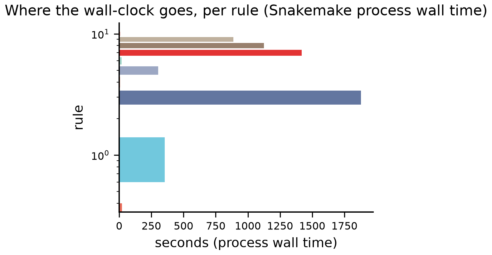
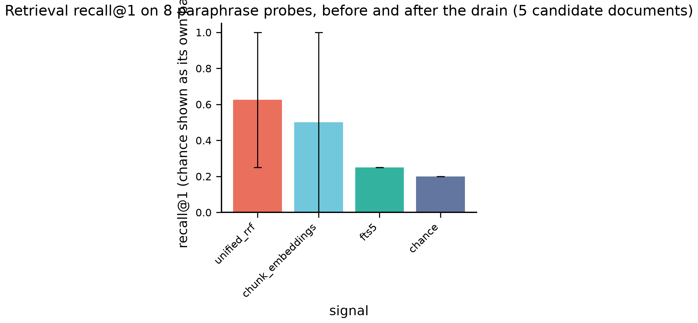
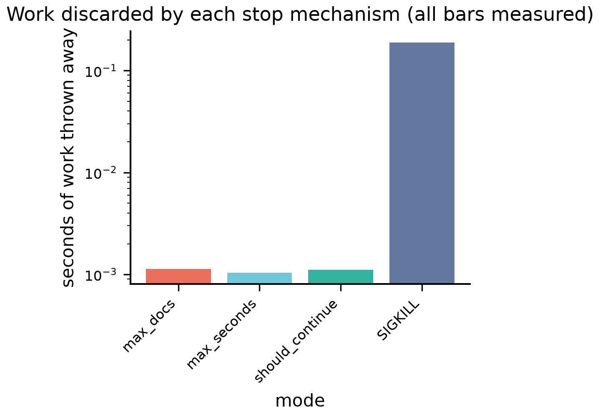
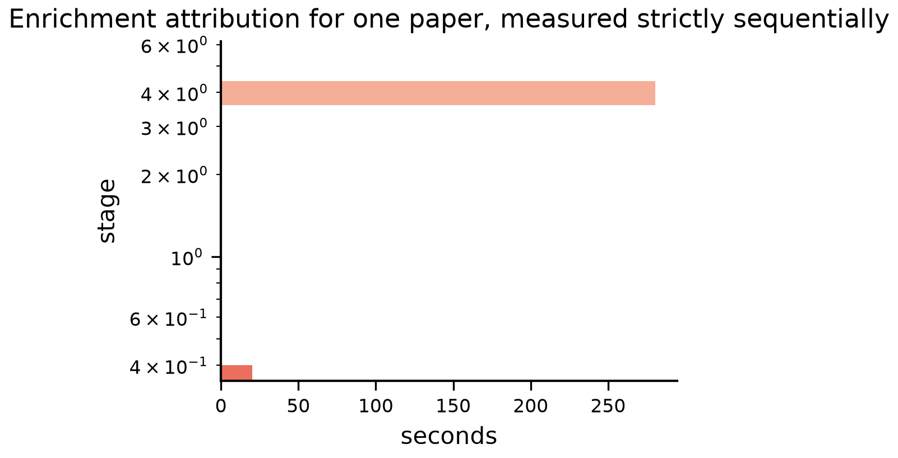

# Deferred ingestion on the real path

A pre-registered, ledger-instrumented validation of the `document_store` drain
against real arXiv PDFs and a local Ollama.

- **run_id**: `2026-08-01T11:41:20.809973+00:00-2ad69e5`
- **git**: `2ad69e5` on `exp/docstore-deferred-validation` (working tree DIRTY)
- **host**: macOS-26.6-arm64-arm-64bit

## Models (pinned by digest, not by tag)

| role | tag | digest | quantisation |
|---|---|---|---|
| — | `gemma4:26b-nvfp4` | `c8656f50f0a6d864cffd` | nvfp4 |
| — | `embeddinggemma:latest` | `85462619ee721b466c59` | BF16 |

## Scoreboard

33 PASS · 0 FAIL · 0 INCONCLUSIVE · 0 NOT MEASURED

| id | claim | metric | threshold | measured | verdict | note |
|---|---|---|---|---|---|---|
| `H-G` | enrichment gate | `gate_topics_count` | `>= 1` | 3 | **PASS** | — |
| `H-a1` | a | `defer_ollama_requests` | `== 0` | 0 | **PASS** | — |
| `H-a2` | a | `defer_state_violations` | `== 0` | 0 | **PASS** | — |
| `H-a3` | a | `defer_median_seconds` | `< 1.0` | 0.009222 | **PASS** | — |
| `H-a3` | a | `defer_now_ratio` | `< 0.02` | 4.915e-05 | **PASS** | — |
| `H-a4` | a | `defer_fts_misses` | `== 0` | 0 | **PASS** | — |
| `H-a5` | a | `source_fts_hits` | `== 0` | 0 | **PASS** | — |
| `H-b` | b | `drain3_enriched` | `== 0` | 0 | **PASS** | — |
| `H-b` | b | `drain3_ollama_requests` | `<= 2` | 0 | **PASS** | — |
| `H-b` | b | `fingerprint_moved` | `== 0` | 0 | **PASS** | — |
| `H-c1` | c | `ledger_entries` | `== 3` | 3 | **PASS** | — |
| `H-c1` | c | `ledger_duplicates` | `== 0` | 0 | **PASS** | — |
| `H-c1` | c | `resume_converted` | `== 2` | 2 | **PASS** | — |
| `H-c2` | c | `markdown_sha_stable` | `== 1` | 1 | **PASS** | — |
| `H-c3` | c | `sqlite_ok` | `== 1` | 1 | **PASS** | — |
| `H-c4` | c | `—` | observation | 0 | **OBSERVATION** | observation only — no pre-registered threshold |
| `H-d1` | d | `pause_midstage_documents` | `== 0` | 0 | **PASS** | — |
| `H-d1` | d | `pause_discarded_document_fraction` | `< 0.5` | 1.568e-05 | **PASS** | — |
| `H-d5` | d | `should_continue_stopped_early` | `== 1` | 1 | **PASS** | — |
| `H-d5` | d | `should_continue_remaining` | `>= 1` | 1 | **PASS** | — |
| `H-d2` | d | `max_seconds_overrun_documents` | `<= 1` | 0.8091 | **PASS** | — |
| `H-d3` | d | `first_processed_is_source` | `== 1` | 1 | **PASS** | — |
| `H-d4` | d | `documents_pending_enrich_at_resume` | `== 1` | 1 | **PASS** | — |
| `H-d4` | d | `kill_repeated_enrichment_over_conversion` | `< 1.0` | 0.01192 | **PASS** | — |
| `H-e1` | e | `post_chunk_recall_at_1` | `>= 1.0` | 1 | **PASS** | — |
| `H-e1` | e | `pre_unified_recall_at_3` | `< 0.5` | 0.25 | **PASS** | — |
| `H-e1` | e | `post_unified_recall_at_3` | `>= 1.0` | 1 | **PASS** | — |
| `H-e2` | e | `enrichment_structure_violations` | `== 0` | 0 | **PASS** | — |
| `H-f1` | f | `failed_count` | `== 4` | 4 | **PASS** | — |
| `H-f1` | f | `errors_without_type_name` | `== 0` | 0 | **PASS** | — |
| `H-f2` | f | `retry_wrong_stage` | `== 0` | 0 | **PASS** | — |
| `H-f2` | f | `stage_test_converter_calls_good_doc` | `== 0` | 0 | **PASS** | — |
| `H-x` | cross-cutting | `report_db_mismatches` | `== 0` | 0 | **PASS** | — |
| `H-m1` | cross-cutting | `concurrency_speedup` | `<= 1.3` | 1.052 | **PASS** | — |
| `OBS/stage_test_converter_calls_total` | observation | `stage_test_converter_calls_total` | observation | 3 | **OBSERVATION** | measured and reported; no pre-registered threshold |
| `OBS/pause_discarded_seconds` | observation | `pause_discarded_seconds` | observation | 0.003289 | **OBSERVATION** | measured and reported; no pre-registered threshold |
| `OBS/pre_chunk_recall_at_3` | observation | `pre_chunk_recall_at_3` | observation | 0 | **OBSERVATION** | measured and reported; no pre-registered threshold |
| `OBS/post_chunk_recall_at_3` | observation | `post_chunk_recall_at_3` | observation | 1 | **OBSERVATION** | measured and reported; no pre-registered threshold |
| `OBS/post_chunk_mrr` | observation | `post_chunk_mrr` | observation | 1 | **OBSERVATION** | measured and reported; no pre-registered threshold |

## Cross-cutting observations

| observation | value | why it matters |
|---|---|---|
| max concurrent Ollama requests in flight (GLOBAL) | 8 | whole-process depth over all endpoints at once — an upper bound on any single one, not an attribution |
| &nbsp;&nbsp;peak on `/api/embeddings` | 8 | counted by a per-endpoint in-flight counter |
| &nbsp;&nbsp;peak on `/v1/chat/completions` | 5 | counted by a per-endpoint in-flight counter |
| &nbsp;&nbsp;peak on `/api/embed` | 2 | counted by a per-endpoint in-flight counter |
| &nbsp;&nbsp;peak on `/robots.txt` | 1 | counted by a per-endpoint in-flight counter |
| &nbsp;&nbsp;peak on `/pdf/0000.00000` | 1 | counted by a per-endpoint in-flight counter |
| deepest fan-out attributed to | `/api/embeddings` | The deepest fan-out is on /api/embeddings at 8 concurrent requests, counted by a per-endpoint in-flight counter. The global figure beside it is the whole-process depth over all endpoints at once and is an upper bound on any single one. Two distinct fan-outs exist and must not be conflated: core.embeddings.make_embedder gathers /api/embeddings under Semaphore(8) inside the chunker's embedding_fn, and _run_phase2 gathers chunk-metadata extraction on /v1/chat/completions under Semaphore(_INGEST_CONCURRENCY=5). Both are PRE-EXISTING library behaviour, reported not changed — and both contradict this project's one-inference-at-a-time rule. |
| doc-embedding skip rate | 0 | `_embed_doc_level` swallows an oversized-input failure with an INFO log, so one of the four RRF signals can go dark without an error |
| preflight tax, min / median / max | 1.424 / 1.808 / 2.157 s over 2 requests | what a cron-driven drain pays on every wake-up. The COLD run (the one a cron wake-up actually resembles) is 2.157 s; all three ran back-to-back against an already-warm Ollama, so none is a true cold start |
| checkpoint savings | 15.71 s | conversion seconds not repeated after the hard kill, from this lineage's own converter ledger. INCLUDES one-time Docling initialisation (4.7 s, measured by converting one PDF twice); the MARGINAL saving is the warm cost, 11.53 s |
| enrichment discarded by the SIGKILL | 0.1873 s | measured as killed_at minus the converter ledger's last ts_end — the work the resume redoes |
| concurrency speedup | 1.052 | sequential total over in-pipeline seconds for the SAME doc_uuid (attributed by identity, never by title). **n=1, NO VARIANCE ESTIMATE.** The lineage does contain a second enrichment of identical content, but it settled at a drain's FIRST progress tick, whose interval starts at the drain's t0 and therefore contains the preflight tax and a Docling conversion; attributing it would repeat exactly the error this edition corrected, so it is refused rather than corrected by assumption. Read this ratio as a single observation, not as a measured effect: it is close to 1.0, which is consistent with the fan-out buying nothing against a serialising Ollama, and it is not evidence of a 5% gain. |
| report-vs-database mismatches (H-x) | 0 | all six ProcessReport fields, across every drain including the subprocess resume |
| two-transaction window observed (H-c4) | no | `_convert_document` commits markdown then flips status separately. A NULL result bounds nothing: the two commits are microseconds apart and the poller samples every 0.25 s |
| SIGTERM to exit | 274.2 s | size a launchd/cron shutdown grace period with this. Measured with an UNTRUNCATED document in flight (39009 chars, 26 chunks) = 10.55 s/chunk |
| &nbsp;&nbsp;the same, on a 6000-char truncation | 61.23 s | CONTRAST ONLY, not guidance — ~2 chunks against the corpus's 25-43 |

## Noise band and how a measurement becomes a verdict

Relative spread of per-request latency on `/chat/completions`: 0.4922 over 512 raw samples (one endpoint, one distribution — read from the per-request JSONL ledgers, not from pooled order statistics).

Replicate spread of in-pipeline enrichment: —, from the same content enriched twice inside claim (b) — the run's only true repeated measurement.

Which metrics may be softened to INCONCLUSIVE, what each is compared against, and where its band comes from are all registered in `results/preregistration.json` under `scoring_rules`; the analyzer reads them from there and can no more invent a scoring rule than it can invent a threshold. Post-hoc changes are itemised in `results/deviations.json`.

## Statistical power, stated plainly

- Retrieval probes discriminate between 5 candidate documents, so chance recall@1 is 0.2 and chance recall@3 is 0.6. the probes discriminate between 4 topically disjoint papers with no hard negatives, so this measures 'the index is not empty and not scrambled', NOT 'retrieval quality is high'. Read recall@1 and MRR against the chance baselines above, not recall@3 against 1.0.
- Every timing claim is n=1: one kill, one resume, one pause per mechanism, one drain sequence. The exact count- and state-based hypotheses (H-a1, H-a2, H-b, H-c1, H-c2, H-c3, H-f1, H-x) are discrete facts that need no n; the derived TIMINGS carry no uncertainty except where a replicate exists.

## What is NOT reproducible here

- LLM-generated metadata CONTENT (nondeterministic even at temperature 0)
- wall-clock timings (machine- and load-dependent; ratios are published instead)
- Docling markdown bytes across docling versions or machines

Exactly three things are claimed deterministic:

- queue state transitions
- conversion bytes within a fixed docling version, within one run
- chunk boundaries for a fixed input and chunker configuration

## Figures

*Process wall time per rule (Snakemake `benchmark:`) — one quantity, every rule.*

*recall@1 by signal, before and after the drain, with the chance level plotted as its own bar.*

*Discarded work per stop mechanism. EVERY bar is measured: the library arms from their own post-commit wall-clock, the SIGKILL from `killed_at` minus the converter ledger's last `ts_end`. The CLI arms are deliberately absent — their in-flight document is allowed to finish, so 'discarded seconds' is not the quantity that describes them.*

*Sequential component breakdown for one paper. Note that `extract_units` Stage 2 calls the embedding model, so 'chunking' is not pure CPU.*

## Provenance and integrity

- **harness sha256**: `f427f042e5a957b6ccbd` over 36 files — the Snakefile, config.yaml and every `scripts/*.py`. One value identifies the measuring apparatus.
- `results/provenance.json` — git, versions, model digests, allowlisted env, and `results/working_tree.patch` whenever the tree is dirty (required by `validate_results`, so a run cannot record a sha that names code nobody has)
- `results/preregistration.json` — hypotheses, thresholds AND scoring rules
- `results/deviations.json` — every post-hoc change, with the direction it could have moved a verdict
- `data/REGISTRY.json` — per-paper sha256 + URL provenance
- `results/validation.json` — schema + referential integrity (exits 1 on violation)
- `results/MANIFEST.json` — sha256 of every artefact AND of every harness script; re-check it with `uv run python -m experiments.docstore_deferred_ingestion.scripts.manifest --verify`

